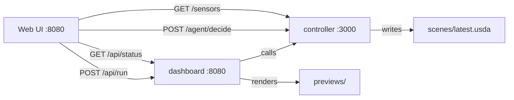

# OpenUSD Kitchen Monitor — AI Agent → USD → Verify

Demo for an Omniverse Developer role: an AI agent reads sensor data (temperature, vibration) →
classifies device status → writes an **OpenUSD** file referencing the official Pixar Kitchen Set,
recolors appliance meshes by status, and validates the resulting USD file.
Results are shown on a web dashboard.

---
## 1. Architecture

```
  Web UI  ── GET /sensors ──▶ controller/server.js ──▶ usd_connector/sync_to_usd.py
  :8080   ── POST /agent/decide                     ──▶ scenes/latest.usda
         ──▶ verify/check_compliance.py
```

| Layer | File | Responsibility |
|-------|------|----------------|
| Perception | `controller/server.js` | Generates telemetry for 4 appliances. Uses OpenRouter tool-calling `set_device_action` for status decisions. Falls back to local heuristic when no API key is configured. |
| Control/Connector | `usd_connector/sync_to_usd.py` | Authors a USD stage referencing the Pixar Kitchen Set and updates `primvars:displayColor` on monitored appliance meshes. Writes `scenes/latest.usda` and `scenes/run_summary.json`. |
| Verify | `verify/check_compliance.py` | Asserts OpenUSD invariants: default prim `World`, up-axis Z, Kitchen reference present, 4 device control prims with colors matching status, no Tf errors. |
| Demo UI | `web/dashboard.js` | Express dashboard that triggers the pipeline, shows front-view renders, status table, USD source, and logs. |

Transparency notes:
- Telemetry is synthetic in this demo.
- "Control" is visual only (mesh recolor), not actuation/physics/closed-loop.
- LLM decisions run only when `OPENROUTER_API_KEY` is set; otherwise the demo uses a local heuristic.

---
## 2. Setup

```bash
./setup.sh
```

This installs Python and Node dependencies, downloads the Pixar Kitchen Set asset,
and creates `.env` from `.env.example`.

Note: `usdrecord` is used for preview rendering. It is included with `usd-core` on macOS.
On Linux, if `usdrecord` is not available, the web dashboard still works; preview images
will simply not be generated.

---
## 3. Run

```bash
./start.sh          # background: controller :3000 + dashboard :8080
./start.sh stop     # stop both
```

Open **http://localhost:8080**

Dashboard:
- **Front view** renders via `usdrecord` (macOS; Linux may skip if unavailable).
- **Devices & status** table with temperature, vibration, and reason.
- **USD source** pane shows `scenes/latest.usda`.
- **Run pipeline** button with adjustable thresholds.
- **Language toggle** persisted in `localStorage`; default is English.

### API

The controller exposes telemetry and decision endpoints.  
The dashboard proxies a few convenience routes for the UI.



**Controller (`localhost:3000`)**

| Method | Path | Purpose | Input | Output |
|--------|------|---------|-------|--------|
| `GET` | `/sensors` | current telemetry for all appliances | none | JSON array of `{id, temperature, vibration}` |
| `POST` | `/agent/decide` | classify status + recolor USD | JSON body: `{sensors:[{id, temperature, vibration}]}` | JSON array of decisions |

**Dashboard (`localhost:8080`)**

| Method | Path | Purpose | Input | Output |
|--------|------|---------|-------|--------|
| `GET` | `/api/list` | list appliances | none | JSON array of device ids |
| `GET` | `/api/status` | latest decisions + reasons | none | JSON object with device statuses |
| `POST` | `/api/run` | run full pipeline with custom thresholds | query `te`, `tw` | redirects to `/` after processing |
| `GET` | `/api/scene/latest.usda` | download the generated USD file | none | `latest.usda` binary |

**Example: decide request/response**

```bash
curl -X POST http://localhost:3000/agent/decide \
  -H 'Content-Type: application/json' \
  -d '{"sensors":[{"id":"fridge","temperature":90,"vibration":2}]}'
```

```json
[
  {
    "id": "fridge",
    "status": "error",
    "temperature": 90,
    "vibration": 2,
    "reason": "error threshold (local heuristic, T>=85.0 or V>=9.0)"
  }
]
```

**Example: sensors response**

```bash
curl http://localhost:3000/sensors
```

```json
[
  {"id":"fridge","temperature":85,"vibration":1},
  {"id":"toaster","temperature":78,"vibration":6},
  {"id":"kettle","temperature":45,"vibration":1},
  {"id":"ceil_light","temperature":72,"vibration":4}
]
```

---
## 4. Verify (no GPU required)

```bash
make test
```

- B1: controller tests pass.
- B2: generates `scenes/latest.usda`.
- B3: compliance passes on `scenes/latest.usda` and `scenes/kitchen_baseline.usda`.
- Previews: `previews/preview.png` and `previews/preview_before.png`.

---
## Repo hygiene

- Generated artifacts (`scenes/`, `previews/`, `.run/`) are gitignored.
- `controller/package-lock.json` and `web/package-lock.json` are gitignored.
- `assets/KitchenSet/` and `assets/Kitchen_set.zip` are gitignored.
- `.env` is gitignored; `.env.example` is committed.

## Portability checklist
- Copy the repo to another machine.
- Run `./setup.sh` to install dependencies and download assets.
- Optionally copy `.env.example` to `.env` to configure `OPENROUTER_API_KEY` or `CONTROLLER_URL`.
- Run `./start.sh` and open `http://localhost:8080`.
- If `CONTROLLER_URL` points to a remote host, ensure the controller is reachable from the machine running `sync_to_usd.py`.
- On Linux, if `usdrecord` is missing, the dashboard still works; preview rendering will be skipped.
